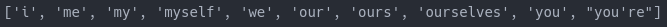
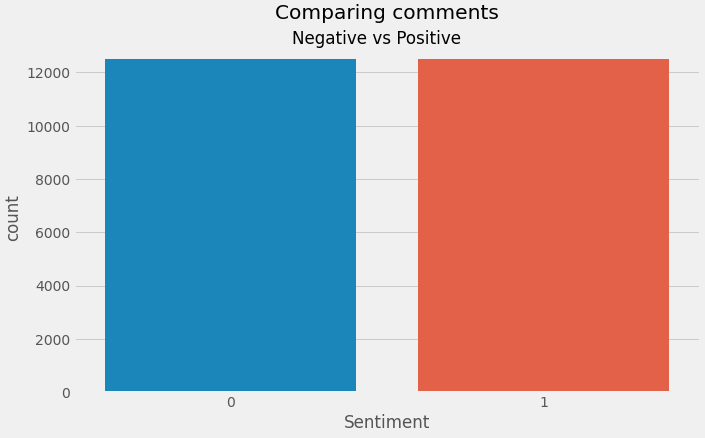

### IBM Comment Sentiment Analysis


## A NLP project to classify comment sentiments from the IBM web page.

It's a personal project to practice the acomplishment of the NLP project structures using libraries like **pandas**, **regex**, **nlt**, **matplotlib**, **seaborn** for data manipulation and visualization. Regarding to Machine Learning, **sklearn**.

---

# Development

The aim of the project is to predict negative and positive comments, so is used a classification algorithm for a binary output: 0 genative, and 1 positive.

The data is in list format, therefore, was just about to iterate through the list and remove special characters from it by iteration.
Here's an example:


Next was to download the english stop words from the **nltk** library and remove them from our comments.
Here some of them:



Always an important thing to do is to check the target, happily it's balanced, so there will no problem of underfitting nor overfitting in this case, regarding to the target.
Both train and test got the same amount.



Then the last step was to train two models, **Logistic Regression**, and **Support Vector Machine**, appliying **CountVectorizer** with this parameters.

```

logreg = Pipeline(steps=[
('vectorizer', CountVectorizer()),
('logreg', LogisticRegression())
])

svm = Pipeline(steps=[
    ('vectorizer', CountVectorizer()),
    ('svm', LinearSVC())
])

logreg_param = {
    'vectorizer__binary': [True],
    'vectorizer__ngram_range': [(1, 3)],
    'vectorizer__stop_words': [stop_words],
    'logreg__C': [0.01, 0.25, 0.5, 1],
    'logreg__penalty': ['l1', 'l2']
}

svm_param = {
    'vectorizer__binary': [True],
    'vectorizer__ngram_range': [(1, 3)],
    'vectorizer__stop_words': [stop_words],
    'svm__C': [0.01, 0.25, 0.5, 1],
    'svm__penalty': ['l1', 'l2']
}

logreg_search = RandomizedSearchCV(
    logreg,
    logreg_param,
    scoring = 'accuracy',
    n_jobs = -3,
    cv = 5
)

svm_search = RandomizedSearchCV(
    svm,
    svm_param,
    scoring = 'accuracy',
    n_jobs = -3,
    cv = 5
)

grids = {
    'rs_log_reg': logreg_search,
    'rs_svm': svm_search
}

```

The algorithm with the best scoring is **SVM** with an Accuracy score in test of **0.88756**